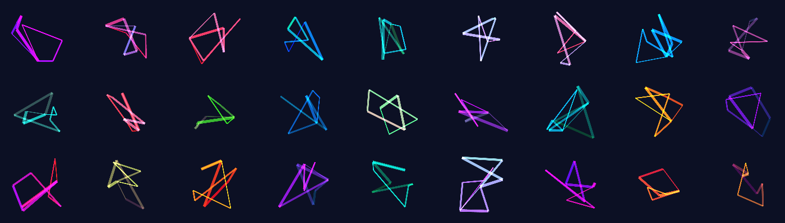
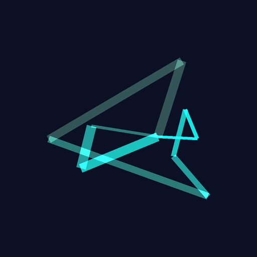
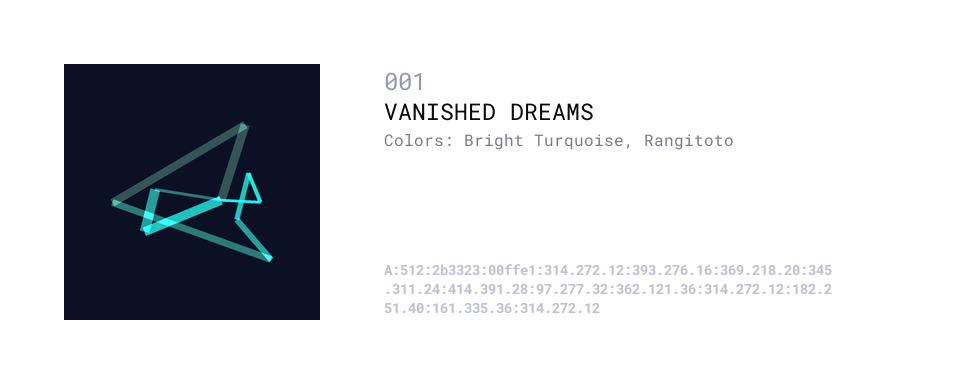

# Machine Psychology: Python Generated Art

A limited collection of 64 algorithmically generated artwork. Each unique piece is then given a title by the [OpenAI GPT-3](https://openai.com/) language model.



This repository contains the code logic to generate the artwork. You can check out the full gallery at https://www.mach-psy.com/ and view the NFTs on [OpenSea](https://opensea.io/collection/mach-psy).

## Usage

If you want to use this from the root directory, first make sure `./src` is on the `PYTHONPATH`.

```bash
export PYTHONPATH=$PYTHONPATH:"./src"  
```

(Optional) If you want to use OpenAI name generation, you also need to set up the API key otherwise the name generator will just label all pieces `Untitled`.

```bash
export OPENAI_API_KEY=<YOUR_API_KEY>
```

Now you can generate the collection.

```bash
python src/cmd_generate.py --collection "myCoolCollection" -n 100 -i 1
```

This will generate a set of artwork called `myCoolCollection`, starting at index 1, and it will make 100 pieces.

## Output

In the output, we will have the actual artwork itself, like this:



There will also be a meta-data file.

```json
{
    "item_id": "001",
    "title": "VANISHED DREAMS",
    "start_color_name": "Rangitoto",
    "end_color_name": "Bright Turquoise",
    "code": "A:512:2b3323:00ffe1:314.272.12:393.276.16:369.218.20:345.311.24:414.391.28:97.277.32:362.121.36:314.272.12:182.251.40:161.335.36:314.272.12"
}
```

And there will be a preview image that combines both things.



## Creation Process

Each item is generated by an algorithm. The first step is to pick the primary colors for the artwork. 
I pick a random HSV value in a range, then a secondary color based off of that.

```python
def generate_starting_color():

    # Choose starting HSV values.
    h = random.random()
    s = random.choice([0.3, 0.5, 1, 1])  # Favor saturated colors.
    v = random.choice([0.2, 0.8])  # Either dark or bright.

    return Color.hsv_float_to_rgb_int((h, s, v))
```

I also name the colors (this is important later) using a color-lookup table that picks the closest (Euclidean distance) match on its HSV value. 

> The color-to-name mapping logic was ported from an open-source JS script by [Chirag Mehta](https://chir.ag/projects/name-that-color/#6195ED).

```python

class ColorNameMapper:
    def __init__(self, hex_color_map: str) -> None:
        self.color_names: List[Color] = []
        ...
```

The art itself is then generated by drawing a series of connected lines, with variable thickness. The color and thickness changes between each point. These colors, points, and thickness are then serialized into a code like this:

```
A:512:332823:29ff00:392.293.12:341.337.16:208.141.20:294.207.24:392.293.12:196.286.28:119.371.32:139.350.36:137.330.40:392.293.12
```

...which is then used to render the image. In this way, the meta-data also contains a redundant back-up of the image itself.

## Name Generation

Finally, this is the most interesting part for me. The title of each piece is also generated by machine as well.

The color names (e.g. `Rangitoto`, `Bright Turquoise`) are used as part of a prompt to **OpenAI GPT-3** language model.

It comes up with some very interesting stories for each image. For example:

* VANISHED DREAMS
* LET’S BURN THE CROWS
* FROZEN OCEAN

Together the names and the images are both machine generated, and evoke some story or emotion (at least to me), which is why I called this collection "Machine Psychology."

## ERC 721

I've also added the test ERC-721 contract I was planning to use to mint these, but I didn't go ahead 
with it because of the gas fees (approx. $1200 at time of writing) to deploy the contract.

I did test it briefly on the Ropsten network though, and it should be reasonable to build out into
a working contract if I need it someday.